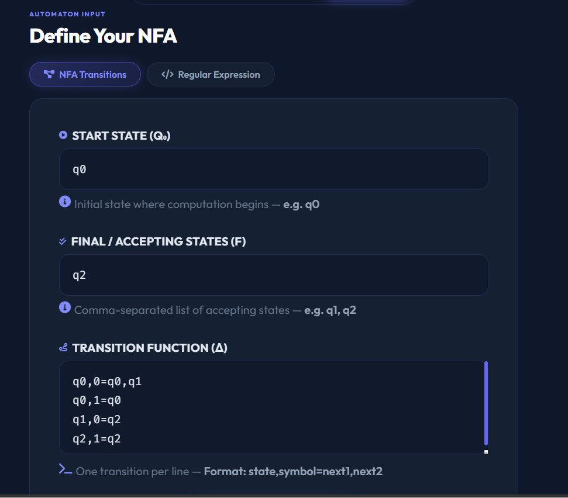
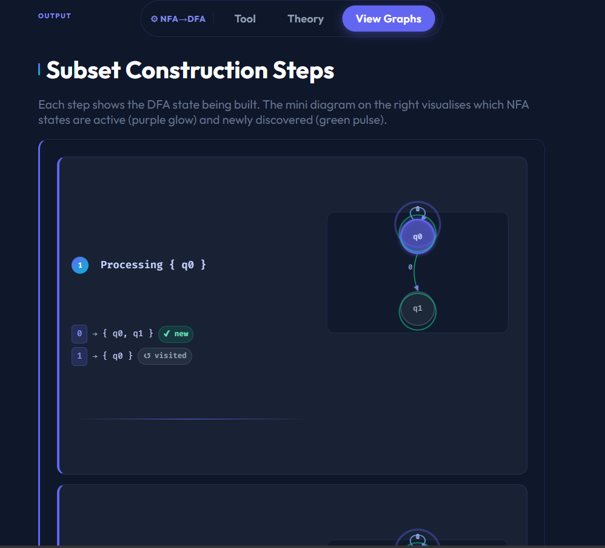
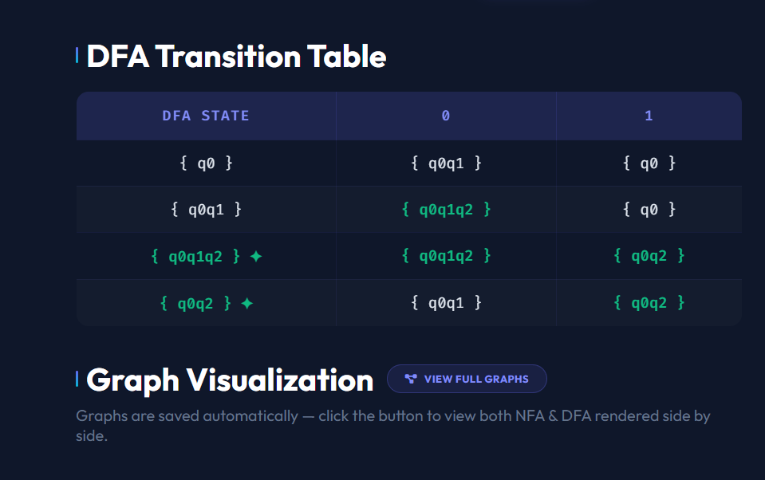
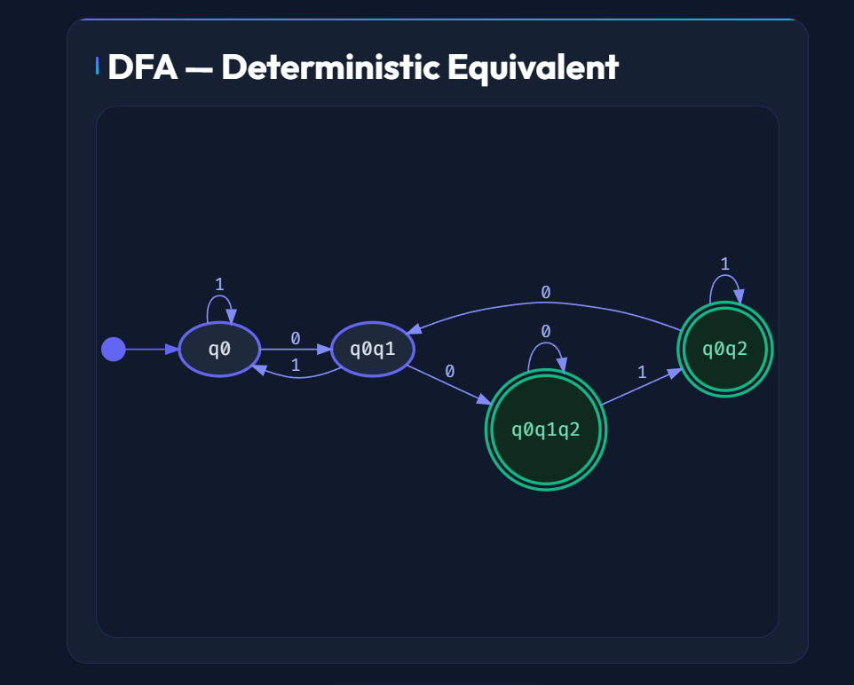

# NFA → DFA Converter & Visualizer

> **Course Project** — Mathematics and Computing, 4th Semester  
> **Developer:** Ashutosh Kumar | Roll No: 2024UCM2304  
> **Institution:** Netaji Subhas University of Technology (NSUT), Delhi

---

## Project Overview

This is a fully browser-based web application that converts a **Non-Deterministic Finite Automaton (NFA)** into an equivalent **Deterministic Finite Automaton (DFA)** using the **Subset Construction Algorithm**. The tool is designed to help students of Automata Theory visually understand how NFA-to-DFA conversion works — with step-by-step output, a transition table, and interactive graph rendering.

live link-https://2024ucm2304-nfa-2-dfa.netlify.app/

---

## Live Pages

| Page | File | Description |
|------|------|-------------|
| Main Tool | `index.html` | NFA input form + conversion output |
| Graph View | `graphs.html` | Visual NFA and DFA graph rendering |
| Theory | `theory.html` | Theoretical background and concepts |

---

## Features

### Core Functionality
- **NFA to DFA Conversion** using the Subset Construction (Powerset Construction) algorithm
- Accepts any valid NFA defined by start state, final states, and transition rules
- Automatically detects all states and alphabet symbols from the transitions input
- Handles **dead states (∅)** — transitions leading to empty sets are explicitly shown
- Final states in the DFA are correctly identified if they contain any NFA accepting state

### Step-by-Step Output
- Each step of the subset construction is displayed with the current state set being processed
- Shows every input symbol transition: `δ( {states}, 'symbol' ) → { next states }`
- Indicates when a new DFA state is discovered (`✔ New DFA state discovered`)
- Indicates when a state set has already been visited (`↺ Already visited`)
- Numbered steps for easy tracing

### DFA Transition Table
- Cleanly formatted table showing all DFA states and their transitions for each input symbol
- **Final/accepting states** are highlighted with a distinct color and marked with ✦
- **Dead states (∅)** are visually dimmed to distinguish them from valid transitions
- States in the table use set notation: `{ q0q1 }` format

### Graph Visualization (graphs.html)
- **NFA Graph** rendered as a directed graph with labeled edges
- **DFA Graph** rendered as the equivalent deterministic automaton
- Powered by **Viz.js (Graphviz)** — industry-standard graph layout engine
- Graphs are styled with:
  - Purple/indigo colored nodes and edges
  - Green double-circle nodes for accepting/final states
  - Arrow pointing to start state
  - Transparent background for clean rendering
- Graphs are saved to `localStorage` after conversion and loaded automatically on the graphs page
- Graceful error handling if no conversion has been run yet

### Theory Page (theory.html)
- Covers **Regular Languages** — definition, properties, and use in compiler design
- Explains **NFA (Non-Deterministic Finite Automaton)** — formal definition and behavior
- Explains **DFA (Deterministic Finite Automaton)** — formal definition and acceptance condition
- Side-by-side **DFA vs NFA comparison** with reference images
- Full explanation of the **Subset Construction Method** with worked example images
- All theory is sourced from standard automata theory curriculum

### UI & User Experience
- **Floating glassmorphism navbar** — fixed at top with links to all pages
- **Hero landing section** with animated gradient title, floating orbs, and background grid
- **Feature cards** section previewing the three main outputs before the form
- **Scroll reveal animations** — sections animate into view as you scroll
- **Loading state on convert button** — spinner icon while processing
- **Auto-scroll to results** after conversion completes
- **Toast notification** — bottom-right popup confirming conversion success
- **Sample NFA pre-loaded** — tool is ready to run with one click on page load
- **Example graph** rendered in the instructions section using the sample NFA
- Fully responsive layout for desktop and mobile screens

---

## How to Use

### 1. Open `index.html` in any modern browser

No server needed. Just open the file directly.

### 2. Enter your NFA

Fill in the three input fields:

**Start State**
```
q0
```

**Final States** (comma-separated)
```
q2
```

**Transitions** (one per line, format: `state,symbol=next1,next2`)
```
q0,0=q0,q1
q0,1=q0
q1,0=q2
q2,1=q2
```

### 3. Click "Convert to DFA"

The page will display:
- Step-by-step subset construction trace
- Complete DFA transition table

### 4. View Graphs

Click **"View Full Graphs"** to open `graphs.html` and see the rendered NFA and DFA diagrams side by side.

---

## Input Format Reference

```
<current_state>,<input_symbol>=<next_state1>,<next_state2>,...
```

| Field | Description | Example |
|-------|-------------|---------|
| Start State | Single state name | `q0` |
| Final States | Comma-separated state names | `q1, q2` |
| Transitions | One rule per line | `q0,a=q1,q2` |

## 📸 Screenshots

| Input Panel | Subset Construction Steps |
|:-----------:|:-------------------------:|
|  |  |

| DFA Transition Table | Full Graph View |
|:--------------------:|:---------------:|
|  |  |

---


**Rules:**
- State names can be any alphanumeric string: `q0`, `A`, `s1`, etc.
- Input symbols can be any character: `0`, `1`, `a`, `b`, etc.
- Multiple next states are comma-separated after the `=`
- If a state has no transition on a symbol, simply omit that line (it will be treated as going to ∅)
- No spaces required, but spaces around state names are trimmed automatically

---

## Sample NFA

The following NFA accepts all binary strings ending in `00`:

```
Start State:   q0
Final States:  q2

Transitions:
q0,0=q0,q1
q0,1=q0
q1,0=q2
q2,1=q2
```

This NFA is pre-loaded in the tool. Click **Convert to DFA** to run it immediately.

---

## File Structure

```
project/
│
├── index.html       ← Main converter tool (homepage)
├── graphs.html      ← Graph visualization page
├── theory.html      ← Theory and concepts page
├── script.js        ← NFA→DFA algorithm + Graphviz DOT generation
├── style.css        ← All styling, animations, and layout
├── README.md        ← This file
│
└── images/          ← Theory reference images
    ├── download.png
    ├── Screenshot 2026-04-03 103026.png
    ├── Screenshot 2026-04-03 103119.png
    ├── Screenshot 2026-04-03 123440.png
    ├── Screenshot 2026-04-03 123509.png
    ├── Screenshot 2026-04-03 123517.png
    ├── Screenshot 2026-04-03 124532.png
    └── Difference-between-DFA-and-NFA.webp
```

---

## Technology Stack

| Technology | Purpose |
|------------|---------|
| HTML5 | Page structure and markup |
| CSS3 | Styling, animations, responsive layout |
| Vanilla JavaScript | NFA→DFA algorithm and DOM manipulation |
| [Viz.js v2.1.2](https://github.com/mdaines/viz.js) | Graphviz graph rendering in browser |
| [Font Awesome 6](https://fontawesome.com/) | Icons |
| [Google Fonts — Outfit + Fira Code](https://fonts.google.com/) | Typography |
| `localStorage` | Persisting graph data between pages |


---

## Algorithm Details

### Subset Construction (Powerset Construction)

The algorithm converts an NFA `N = (Q, Σ, δ, q₀, F)` to a DFA `D = (2^Q, Σ, δ', {q₀}, F')`:

1. Start with `{q₀}` as the initial DFA state
2. For each unprocessed DFA state (a set of NFA states) and each input symbol:
   - Compute the union of all NFA transitions from any state in the set on that symbol
   - This union becomes a new DFA state
3. Mark a DFA state as accepting if it contains any NFA accepting state
4. Repeat until no new states are found

**Time complexity:** O(2^n) worst case, where n = number of NFA states  
**Space complexity:** O(2^n) for storing all possible state subsets

### Dynamic DOT Generation

After conversion, the tool generates **Graphviz DOT language** strings for both automata and saves them to `localStorage`. When `graphs.html` loads, it reads these strings and renders them as SVGs using Viz.js.

---

## Known Limitations

- ε-NFA (NFA with epsilon transitions) is **not supported** — only symbol-based transitions
- Very large NFAs (10+ states) may produce many DFA states and slow rendering
- Graph layout is handled by Graphviz's default engine; complex graphs may overlap
- `localStorage` must be enabled in the browser (disabled in some private/incognito modes)

---

## Academic Context

**Subject:** Theory of Computation / Formal Languages and Automata  
**Topic:** Finite Automata — NFA to DFA Conversion  
**Algorithm:** Subset Construction (Rabin-Scott Powerset Construction, 1959)  
**Semester:** 4th Semester, B.Tech Mathematics and Computing  
**University:** Netaji Subhas University of Technology (NSUT), Delhi  

---

## Developer

**Ashutosh Kumar**  
Roll No: 2024UCM2304  
B.Tech — Mathematics and Computing  
4th Semester  
Netaji Subhas University of Technology (NSUT), New Delhi

---


